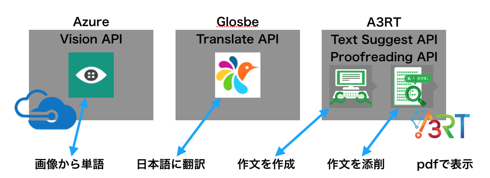

[あなたのコードがどのように動作するのか、簡潔に説明してください。]
[Write a brief explanation about how your code works here.]

# 日記自動生成アプリ [piclog]

## 概要

任意の画像から日記を自動生成する。

## きっかけ
小学生の頃、長期休暇中に"絵日記"という宿題として出されることがあった。
絵日記をもし、"機械"が作成したらどうなるのか、私たちは大変興味を持った。
果たして、機械たちは私たちと同じような絵日記を作成できるのか！私たちの世界を機械たちはどのように認識するのか！
ぜひ、以下の実行コマンドを走らせてご覧ください！


## 利用方法
### 実行コマンド
```
 $ python3 \_application\_name\_  \_IMAGE\_URL\_
```

### 環境構築
```
 $ pip install -r requests.txt
```

### testの方法
```
 $ python -m unittest discover tests
```

### coverageの方法
```
 $ coverage run -m unittest discover tests
```


## PDF作成までの流れ


1. 画像から単語作成の流れ  
`source code : image_analizer.py`  
Azure Vision APIを用いて、CLIで指定した、URLの画像の単語群(英語)を検索する。

2. 単語の翻訳  
`source code : translate.py`  
Glosbeの Translate API を用いて、 Azure Vision API で解析した英単語群を日本語単語に翻訳する。

3. 作文を作成  
`source code : make_sentenceXX.py`  
mecabを使って品詞を判定し、文の中に同じ品詞のものがあれば置き換え、置き換えた続きを A3rt の Text Suggest API を用いて続きの文を作成する。

4. 作文を添削  
`source code : make_sentenceXX.py`  
Text Suggest APIから返された文を Proofreading API を用いて、点数化し、 Text Suggest API で返された文の中で一番良いものを次の評価に利用する。

5. pdfを作成  
`source code : make_pdf.py`  
python3 の reportlab を用いて、pdfを自動生成させる。

##  仕様技術

||利用技術|その他|
|:---|:---|:---|
|言語|python|3.6.1|
|利用API|A3RT Proofreading API|文章添削|
||A3RT Text suggest API|文章作成|
||Azure Vision API|画像から単語を作成|
|ライブラリ|requests|APIリクエスト|
||mecab-python3|自然言語処理|
||pillow|画像処理|
||reportlab|pdf作成|
||coverage|coverage測定|
||python-dotenv|環境変数|

## 工夫した点
1. Azure Vision API
 - A3RTの画像認識APIでは、任意の画像に対する日記の作成が困難なため、Azure Vision APIを用いて、URLから日記を作成できるようにした点。
 - Azureの画像認識APIを用いることによって、英語の値が返ってくるため、翻訳を行なった点。

2. A3RT のAPIの連携
 - Text suggest APIだけでは、画像に関連する作文をすることができないため、Proofreading APIを用いて単語を置き換えて、流暢な日本語を目指した点。

3. 自動的に作文
  - 作文AIの実装を4パターン作成し、一番意味の伝わるものを用いた点。
  - Text Suggest API は後に文章を追加させるAPIなので、絵日記に関する作文をさせるため、品詞判定を行い、置き換えを行なった点。
  
4. Test
 - APIを返す部分・実行すると毎回変わる部分が多く、一部の関数しかテストを行えなかったが、実際にテストを導入した点。さらに、coverageも出せるようにした点。

5. 並列処理  
- 単語群を英語から日本語に翻訳する際にpythonの標準ライブラリのmultiprocessingを用いて並列処理を行なった点。
- core数, core数の2倍, 単語リスト数で処理時間を計測すると、単語リスト数が一番早く処理を行えたため、単語リスト数で翻訳をした点。

6. Python
- PyDocを明記するなどの関数の役割を明確にした点。
- `from file_name import method_name` でfile_name、method_name　ファイル名と関数名を同じにすることにより、可読性・保守性をあげた点。

## 苦労した点
1. チームメンバーとの共有
- 所在地が大阪・兵庫・滋賀に加え、所属大学が違うため、連携が取りずらかった点。
- チームメンバー内で、日常的に利用しているプログラミング言語が異なるため、チーム内で、うまく作業を分担することができなかった点。

2. Azure Vision API から、日本語の単語群を返すことができなかったため、少し不自然な日本語になった点。

3. CodeCheckを使うのが難しかった。  
- pipのパッケージについて、ドキュメントに導入方法が記載されていたが、Mecabのインストールは独自で実装した。  
- 自動生成したファイルが、Webのコンソールに表示されないため、python でlsを行い実際にファイルが存在することを確認した。

4. Glosbe Translate APIでうまく翻訳できない部分があった。
- 'pooling', 'pulled' など動名詞や過去形などがうまく翻訳されず、Noneとして値が返ってくるため、作文の時にskipさせた。
- 馬車が映った写真で、 carriageで調べると、乗り物・四輪馬車・のりもの...などが出てきて、元の画像と違った訳になってしまったこと。

5. 作文作成が難しかった。
- オブジェクト指向的を用いて、文に対して、全部のワード群を利用して、提案・修正を行ったが、最初に書いた直感的なプログラムの方が自然な日本語を生成できた。

## 今回のA3RTに参加し，様々なAPIを触ってみて
1. Test Suggest APIのパラメーターで指定した部分の文字列を含む、作文をしてくれるとより作品の幅が広がったと感じる。
2. Image Search APIの画像の関連ワード出せる機能をクライアント側の画像から出せるようにできたらより使いやすいと思った。
3. Proofreading APIは文章として怪しい箇所のみを指摘するのではなく、添削の提案もしてくれるとAPIとして利用しやすいと感じた。
4. Image Genarate APIで画像を合成させて面白い画像を作ろうと思ったが、爪の合成のみで、使用するのが難しかった。
5. Listing API、Image Influence API、Text Classification APIのように、独自でモデルを作れるのは大変面白いと思った。
6. Talk API は、ユーザーローカル・ドコモ・Microsoftなどがすでに導入しているが負けずに頑張っていただきたいです。
7. 今回のハッカソンを通して、チーム開発や限定されたAPIを使用するという決まりの元、ハッカソンを楽しみながらでき、いい勉強になりました。ありがとうございました。

## 利用外部APIの選定について
1. Azure Vision API  
クライアント側の指定した画像の解析が可能であること。
(※ 工夫 1. と同じ）

2. Globe Translate API  
「Python 翻訳 API」と検索した際に使用しやすそうだったため使用した。
Azure Translate API を利用しようとしたが時間がなかったため断念した。

## 参考

### pdf生成
- [PythonでPDFを生成したい そしてサイコロを作りたい - \[\[ともっくす alloc\] init\]](http://o-tomox.hatenablog.com/entry/2013/07/22/221158)
- [pythonでReportLabを使ったPDFファイルの作り方〜その２〜 - Live the Life you Lov](http://www.llul.info/entry/2016/11/07/python%E3%81%A7ReportLab%E3%82%92%E4%BD%BF%E3%81%A3%E3%81%9FPDF%E3%83%95%E3%82%A1%E3%82%A4%E3%83%AB%E3%81%AE%E4%BD%9C%E3%82%8A%E6%96%B9%E3%80%9C%E3%81%9D%E3%81%AE%EF%BC%92%E3%80%9C)
- [Python + Pillow(PIL)で画像の回転を行う(rotate, transpose) - Symfoware](http://symfoware.blog68.fc2.com/blog-entry-1533.html)

## test
- [Python 3 標準の unittest でテストを書く際のディレクトリ構成 - Qiita](https://qiita.com/hoto17296/items/fa0166728177e676cd36)
- [初心者のためのPythonにおけるソフトウェアテスト - MyEnigma](http://myenigma.hatenablog.com/entry/2015/05/23/173423#テストカバレージ)

## Azure
- [Computer Vision Python Quick Starts](https://docs.microsoft.com/ja-jp/azure/cognitive-services/computer-vision/quickstarts/python)

## package管理
- [pipのlistとfreezeの違い - 君たちは永遠にそいつらより若い](http://kuteken.hatenablog.com/entry/2015/03/21/211936)
